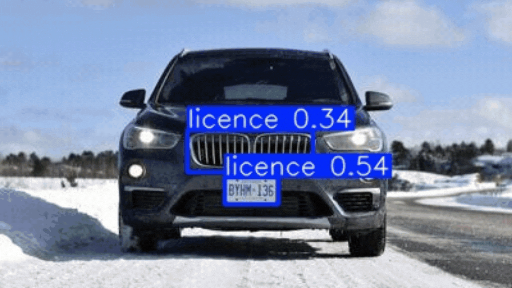

# Custom Object Detection Training with YOLOv11 (and Prediction for Object detection, Segmentation, Classification, and Pose Estimation )

This repository provides a comprehensive implementation of the **YOLOv11** model, showcasing its capabilities in **object detection**, **image segmentation**, **image classification**, and **pose estimation** using a pre-trained model.

Additionally, it demonstrates the training and validation process for object detection with **YOLOv11**, focusing on an example use case of **vehicle license plate detection**.

### Key Features:

- **Pre-Trained YOLOv11 Model**: Use the pre-trained model for **object detection**, **image segmentation**, **image classification**, and **pose estimation**.

- **Object Detection Example**: This repository includes a practical example of **vehicle license plate recognition**, where the model is trained and validated using YOLOv11 for object detection. The training process, validation, and evaluation of the model are all part of this example.

This project demonstrates the versatility of YOLOv11 in various computer vision tasks, leveraging the power of transfer learning and fine-tuning for specific use cases like vehicle license plate detection.

# Requirements

- **Python 3**: This project is developed using Python 3.
  
- **GPU**: For training, a **T4 GPU** from [Google Colab](https://colab.research.google.com/) was used.

All other necessary dependencies are installed at the beginning of the `main.ipynb` file.

## Notes
- Requires active **GPU** (such as a T4 from [Google Colab](https://colab.research.google.com/)) for training.
- **Image files** must be in a compatible format (e.g., PNG, JPEG) for both training and inference.
- **Template files** for object detection (e.g., dataset annotations) must be present for successful training and validation.

## Acknowledgments

- Special thanks to the original repository for **YOLOv11** ([link to YOLOv11 repo](https://github.com/ultralytics/ultralytics)) for providing the base model and implementation that made this project possible.
- Acknowledgments to the repository from which the **vehicle license plate dataset** was sourced ([link to dataset repo](https://github.com/AarohiSingla/YOLOv10-Custom-Object-Detection.git)). This dataset was crucial for training and validating the model.

License
-------

This project is licensed under the MIT License - see the [LICENSE](./LICENSE) file for details.